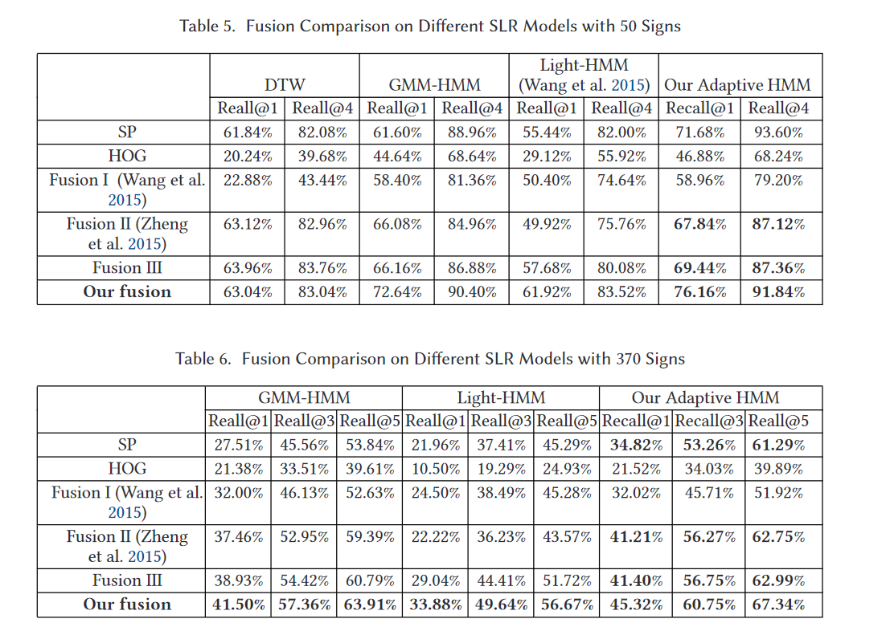
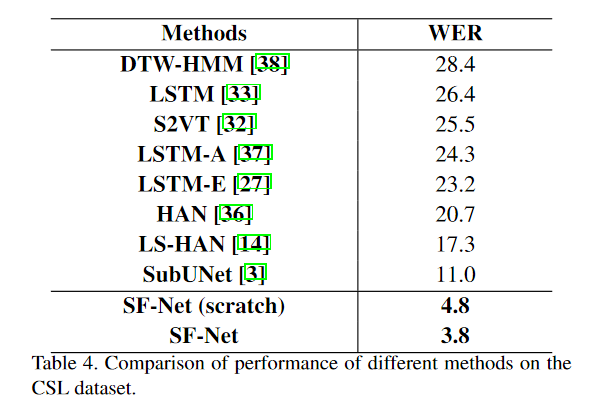
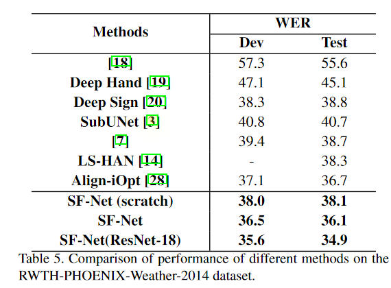
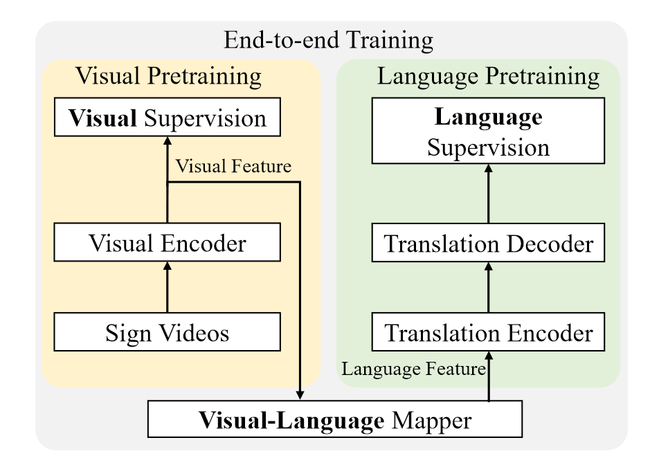
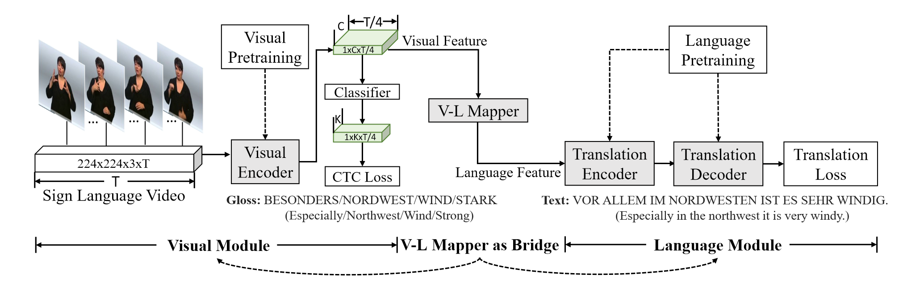
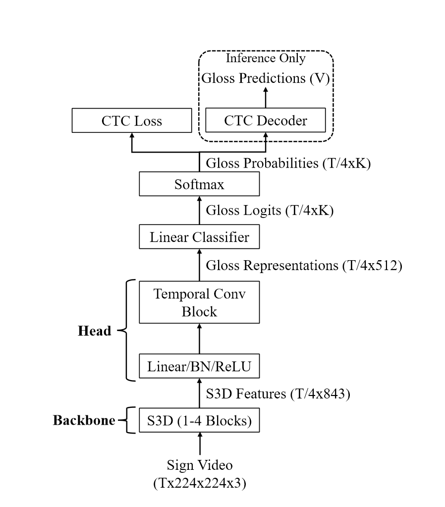

# paper-notes
Notes on the papers I have read about SLR/SLT

[TOC]


## 一、HMM

##### **Online Early-Late Fusion Based on Adaptive HMM for Sign Language Recognition** `TOMM2017` [*paper*](https://dl.acm.org/doi/pdf/10.1145/3152121?download=true) *code*

- 解决问题 : 较少多模态数据集下如何有效提取特征


- 提出的方法 : 基于自适应隐马尔可夫模型（HMM）的特征融合


- 创新：为每个手语词自适应确定一个HMM状态数，同时提出新的特征融合方法（SP+HOG)


- 效果 ： 文章没有对神经网络相关的SLR模型进行对比


- 阅读时间：2023-06-05





## 二、CNN+RNN

*CNN includes 2D CNN and 3D CNN, and RNN includes LSTM and BLSTM.*


##### **SF-Net: Structured Feature Network for Continuous Sign Language Recognition** `ArXiv2019` [*paper*](https://arxiv.org/pdf/1908.01341.pdf) *code*

- 类型：S2T方向（Sign2Text)


- 提出当前的两个问题：对帧而不是gloss学习；有些方法需要额外模型来组合句子


```
1. models used in these methods manage to learn features and alignments from the frame level. 
  This could have limited the representativeness of features as single frames are far from the completion of a gloss.
  Also, the number of frames that a gloss lasts may vary dramatically, which could introduce uncertainty in alignment learning. 

2. some methods still need the help of additional models such as Hidden Markov Models (HMMs) or language models to construct the final sentence. 
  This could have limited the adaptability of the method as it requires careful tweaking of the whole system for a specific dataset.
```

- 解决问题 : 同上


- 提出的方法 : Structured Feature Network (SF-Net)，将帧级别，gloss级别，句子级别内容编码为特征，通过贪心将特征翻译为句子，实现端到端翻译


- 创新：同上


- 效果 ： 在CSL（实验室环境），RWTH-PHOENIX-Weather-2014（开放环境）下使用WER指标都取得了较好的结果


<center class="half">
    
    
</center>
- 
  阅读时间：2023-06-06


##### **Neural Sign Language Translation** `CVPR2018` [*paper*](http://openaccess.thecvf.com/content_cvpr_2018/papers/Camgoz_Neural_Sign_Language_CVPR_2018_paper.pdf) [*code*](https://github.com/neccam/nslt)

类型：S2T方向（Sign2Text)

提出的方法 : 

创新：

效果 ：


## 三、3D CNN


## 四、GCN


## 五、Others

##### **A Simple Multi-Modality Transfer Learning Baseline for Sign Language Translation** `CVPR2022` [*paper*](https://arxiv.org/pdf/2203.04287.pdf) [*code*](https://github.com/FangyunWei/SLRT)

- 类型：Sign2Gloss + Gloss2Text


- 提出当前的问题：当前使用NMT（neural machine translation)的方法但该方法需要大量的数据，而当前手语数据缺少


- 提出的方法 : 引入其他部分更通用的数据集一起训练


<center class="half">
    
    
</center>


- 创新：提出两阶段预训练（Sign2Gloss + Gloss2Text）+map，通过利用可以有效转移到手语翻译的现有数据集和监督，减少了收集大量并行数据的必要性。


- 效果 ：

- 相关关联文献：**Rethinking Spatiotemporal Feature Learning : Speed-Accuracy Trade-offs in Video Classification** `ECCV 2018`（视频分类领域） [*paper*](https://arxiv.org/pdf/1712.04851.pdf) 

  - 提出了S3D模型（用一些2D卷积替换掉原来的3D卷积），采用连续的每个3D卷积替换为两个连续的卷积层：一个2D卷积层用于学习空间特征，然后是一个仅在时间轴上的1D卷积层

  - 效果：压缩模型大小和提高处理速度的同时，还能提高准确性

  - 输入：视频帧——输出：分类标签
  - 在A Simple Multi-modality Transfer Learning Baseline for Sign Language Translation中，用来将**T × 224 × 224 × 3的图像帧转为预测的gloss特征的分类**

  ​		https://blog.csdn.net/m0_38065546/article/details/94868216

- 阅读时间：2023-06-06

**网络具体流程整理：**

- **Visual Encoder Network : 视频流 => 预测的gloss序列**

  - input：视频流      **output：帧数据T × 224 × 224 × 3** （T是视频帧数）

  - => **S3D模型**           **output:  T/4×832的特征矩阵**  ( 其中832是特征的维度,由预训练好的S3D模型决定)

    [^T/4]: 这个值出现的原因是S3D模型只使用了前四个块。S3D模型是一个3D卷积神经网络，它的设计目标是从视频中提取空间和时间特征。在这个模型中，每一层或者说每一个块都会对输入数据进行一定的下采样，也就是降低数据的分辨率。在这篇文章的模型中，作者只使用了S3D模型的前四个块，这意味着输入数据被下采样了四次。因此，原始的帧数T被降低到了T/4。

  - => **投影块（Projection Block）**一个时间线性层，一个批量归一化层BN和一个ReLU层    **output: ？**

  - =>**时间卷积块（Temporal Convolutional Block）** 两个时间卷积层，一个线性转换层和一个ReLU层    **output: 词汇表示"（gloss representation），其大小为T/4×512，这个表示在高维空间中代表了手势类别。**（512为特征的维度）

  - =>**一个线性分类器MLP和一个Softmax函数**   **output: T/4×K，其中K是词汇表的大小。这个词汇概率表示了每一帧对应的手势类别的概率**(gloss类别)

  - =>**CTC decoding**      **output:生成预测的gloss序列**

[^CTC loss]: CTC本质上只是一个损失函数，这个损失函数约束神经网络训练出CTC所描述的序列属性（blank分割），就如同softmax约束神经网络训练出的分类属性。在softmax分类问题中解码就是简单的取概率最大的类，但是CTC训练出的序列模型解码就相对复杂多了，有best path ,beam search ,前缀树搜索，还有苗亚杰提出的通过wfst语言模型约束的best path解码。

​	

- **Visual-Language Mapper**  :  ? => ?	
  - 具有两个隐藏层的全连接 MLP
- **Translation Network** ：  gloss sequences =>spoken language texts
  - 利用了mBART预训练模型

